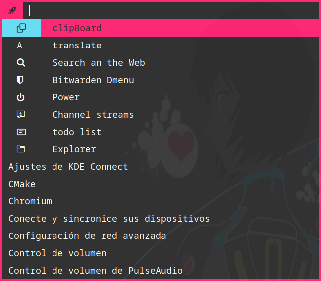

# ohmydmenu

## dmenu - dynamic menu
dmenu is an efficient dynamic menu for X.




### patch and fecture
 
> this patchs you do find 
> in [tool.suckless.org/dmenu/patches](https://tools.suckless.org/dmenu/patches/)

- [alpha](https://tools.suckless.org/dmenu/patches/alpha/) - *opacity*
- [border](https://tools.suckless.org/dmenu/patches/border/) - *border*
- [dynamicoptions](https://tools.suckless.org/dmenu/patches/dynamicoptions/) - *dynamic options.*
- [emoji-highlight](https://tools.suckless.org/dmenu/patches/emoji-highlight/) - *emoji highlight.* 
- [fuzzymatch](https://tools.suckless.org/dmenu/patches/fuzzymatch/) - *match fuzzy.*
- [incremental](https://tools.suckless.org/dmenu/patches/incremental/) - *returns each key pressed.*
- [lineheight](https://tools.suckless.org/dmenu/patches/line-height/) - *set the height of the lines.*
- [linesbelowpront](https://tools.suckless.org/dmenu/patches/lines-below-prompt/) - *more cute*
- [listfullwidth](https://tools.suckless.org/dmenu/patches/listfullwidth/) - *not indent items list for promtf*
- [mousesupport](https://tools.suckless.org/dmenu/patches/mouse-support/) - *support to mouse*
- [password](https://tools.suckless.org/dmenu/patches/password/) - *password -P*
- [preselect](https://tools.suckless.org/dmenu/patches/preselect/) - *preselet opcion*
- [printindex](https://tools.suckless.org/dmenu/patches/printindex/) - *return the index of item select*
- [symbol](https://tools.suckless.org/dmenu/patches/symbols/) - *add symbol of scroll horizontal*
- [vi_mode](https://tools.suckless.org/dmenu/patches/vi-mode/) - *add the keybind of vi*
- [xresouces](https://tools.suckless.org/dmenu/patches/xresources-alt/) - *support Xsoucer*
- [xyz](https://tools.suckless.org/dmenu/patches/xyw/) - *set axis `x`, `y`, `z`*

>this list can change a close latest version for debug action


### Requirements

In order to build dmenu you need the `Xlib` header files.


### Installation
Edit config.mk to match your local setup (dmenu is installed into
the /usr/local namespace by default).

Afterwards enter the following command to build and install dmenu
(if necessary as root):

```sh
make clean install
```
or altenatively you do can execute the script of install, make for me. 

```sh
./install.sh
```

### Running dmenu
See the man page for details.

## script 
the scritps you do can find en la [./script](./script/). 
and they are an serie of utils for dmenu. 
all this cript depencie of dmenu

### dmenu-clipboard 

this script deplaze a menu with 
the history fo clipboard

#### dependecia 
- xclip.
- [notify](https://github.com/cdown/clipnotify).

> this script was take of<br>
> [clipmenu ](https://github.com/cdown/clipmenu)

---
### dmenu-translate
this script get the current item in the 
clipboard and traslate in languaje of sistem. 

#### dependencie 
- [translate-shell](https://github.com/soimort/translate-shell)

---

### dmenu-websearch
this script for seach in the web. 
you can imports your bookmarks of your 
browser. agregando the `bookmars.html` in your `~/.config`

---

### dmenu-bitwarden

> **Avertancias** : I consider this script safe, but use it at 
> your own risk.

a script what allow copy the `username`. `password`, `note`, `url` of you acount of bitwarden. 

#### dependecia
- [bitwarden-cli](https://bitwarden.com/help/cli/) - *(oficial)*
- jq

---

### dmenu-power

A simple menu with opciones of sistemas. 

--- 
### dmenu-channel 

a simple script for select a channel via streamer. <br>
you must put a configuration file where are you channels.<br>
example. <br>
in the directories `~/.config/channels.conf`<br>
tha syntax is `[name]|[url]`

```
COPE|http://195.10.10.46/cope/net1.mp3.m3u
RNE|http://195.10.10.221/rtve/rne.mp3
RNE5|http://195.10.10.45/rtve/radio5.mp3.m3u
RE|http://195.10.10.45/rtve/radioexterior.mp3.m3u
Clásica|http://radiolive-mp3-rtve.flumotion.com/rtve/radioclasica.mp3.m3u
Euskadi|http://hdstreamflash-lh.akamaihd.net/i/Radio_Euskadi_1@109208/master.m3u8

```

#### depedencias 
- `mpv` or `vlc` 
- `mpris`

--- 

### dmenu-todo
an simple script what 
your can write you list of taks. 

---

### dmenu-dbrowers
scritp you allow explore your files and open app or file multimedia. 

---


